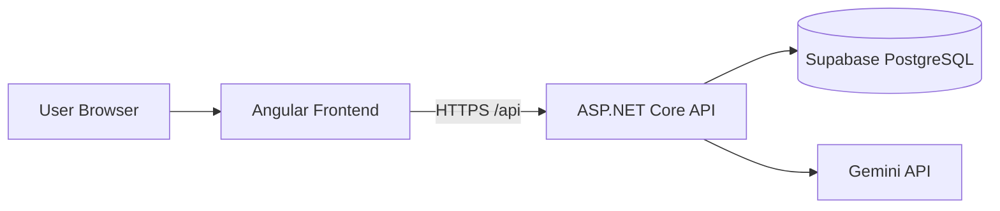
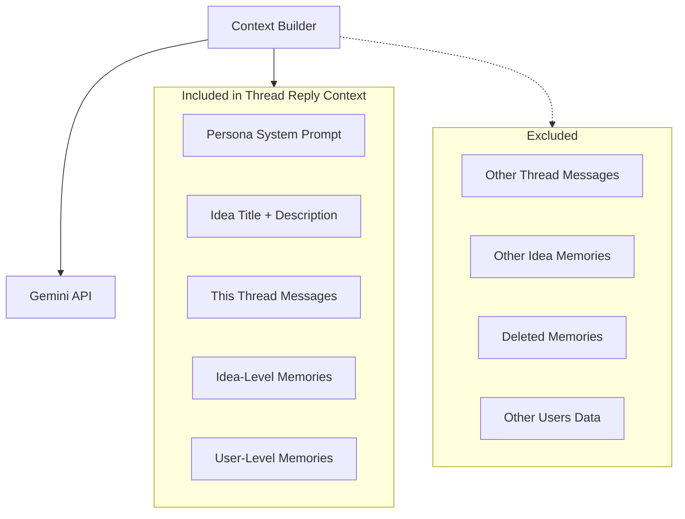

# Architecture

> **Status:** Planning document. Nothing described here is implemented yet.

## System Overview

Idea Sparring Partner is a three-tier web application:

- **Angular frontend** — UI, routing, token storage, API calls
- **ASP.NET Core Web API** — Auth, business logic, AI orchestration, context assembly
- **Supabase PostgreSQL** — Persistent storage for users, ideas, threads, messages, memories, syntheses

External dependency: **Gemini API** for all AI generation.

## Frontend Responsibilities

Planned (not built yet):

| Area | Responsibility |
|------|----------------|
| Routing | Auth routes, dashboard, idea workspace |
| Auth UI | Signup, login, logout |
| Dashboard | List ideas, create new idea |
| Four-panel workspace | One panel per persona thread; send/receive messages |
| Memory viewer | List memories; delete incorrect entries |
| Synthesis UI | Trigger synthesis; view version history |
| HTTP layer | API client, auth interceptor, token refresh |

Frontend stores JWT access token and refresh token (localStorage or sessionStorage for assignment practicality).

## Backend Responsibilities

Planned (not built yet):

| Area | Responsibility |
|------|----------------|
| Auth | Signup, login, JWT issuance, refresh token rotation, logout |
| Idea APIs | Create and list ideas |
| Thread/message APIs | List threads, post messages, fetch history |
| AI orchestration | Call Gemini through an abstraction layer |
| Context builder | Assemble isolated per-thread prompt context |
| Memory extraction | Parse AI responses; classify and persist memories |
| Synthesis generation | Read all four threads; produce versioned synthesis |

## Database Responsibilities

Stores:

- **users** — Accounts and password hashes
- **refresh_tokens** — Hashed refresh tokens with expiry
- **ideas** — Title, description, owner
- **threads** — Four per idea (one per persona)
- **messages** — User and assistant messages per thread
- **memories** — Extracted idea-level and user-level knowledge
- **syntheses** — Versioned cross-thread summaries

See [Schema.md](./Schema.md) for table details.

## Authentication Strategy (Draft)

| Concern | Approach |
|---------|----------|
| Access token | Short-lived JWT (15 minutes), signed with shared secret |
| Refresh token | Opaque token stored **hashed** in `refresh_tokens` table (7 days) |
| Frontend storage | Access + refresh tokens in browser storage for assignment simplicity |
| Logout | Invalidate refresh token server-side; clear client storage |

**Production tradeoff:** HttpOnly, Secure, SameSite cookies for refresh tokens would reduce XSS token theft risk. For this take-home, client-side storage is acceptable with documented tradeoff.

Flow:

1. Login/signup → access token + refresh token returned
2. API calls include `Authorization: Bearer {accessToken}`
3. On 401, frontend calls `/api/auth/refresh` with refresh token
4. Logout revokes refresh token hash in database

## AI Integration Strategy

- All AI calls go through an **`IAiService`** (or equivalent) abstraction
- Initial provider: **Gemini API** via `GEMINI_API_KEY`
- Configuration via `AI_PROVIDER=Gemini` allows future swap (e.g., OpenAI) without changing controllers
- Two AI operations:
  1. **Thread reply** — Persona response in isolated context
  2. **Synthesis** — Cross-thread summary generation
- Memory extraction may use a separate structured prompt or the same service with a different template

Errors from Gemini (rate limit, timeout) return user-friendly API errors; failed calls do not corrupt thread state.

## Context Assembly Strategy

This is the most important design constraint.

### When generating an AI reply in one thread, the backend **includes**:

| Context piece | Source |
|---------------|--------|
| Persona-specific system prompt | Static template per `PersonaType` |
| Idea title and description | `ideas` table |
| Current thread messages only | `messages` where `thread_id` matches |
| Active idea-level memories | `memories` where `scope=Idea`, same `idea_id`, `is_deleted=false` |
| Active user-level memories | `memories` where `scope=User`, same `user_id`, `is_deleted=false` |

### The backend **excludes**:

| Excluded data | Reason |
|---------------|--------|
| Messages from other persona threads | Preserves thread isolation |
| Memories from other ideas | Prevents cross-idea contamination |
| Deleted memories (`is_deleted=true`) | User removed incorrect extractions |
| Data from other users | Authorization boundary |

### Why this matters

- **Thread isolation** keeps four personas from collapsing into one blended conversation
- Each thread feels like a distinct sparring partner
- **Shared knowledge** enters only through explicitly extracted memory — a controlled bridge between isolation and coherence
- Synthesis is the only operation that intentionally reads all four threads at once

## Memory Extraction Strategy

After each **assistant** message in a thread:

1. Run a memory extraction step (prompt or structured parse)
2. Produce **one candidate memory** (or none if nothing worth storing)
3. Classify:
   - **Scope:** `Idea` or `User`
   - **Type:** Fact, Assumption, Constraint, Pattern, etc.
4. Persist as a **`Memory` entity** — not embedded in the message body
5. Optionally link `source_thread_id` and `source_message_id` for traceability

Initial implementation: **synchronous** extraction inline after AI response (simple, debuggable). Async queue is a future improvement.

User can **soft-delete** memories via API; deleted memories are excluded from context assembly.

## Synthesis Strategy

1. User triggers `POST /api/ideas/{ideaId}/syntheses`
2. Backend loads all four threads and their messages for the idea
3. Backend loads idea metadata and optionally active memories for additional context
4. Single Gemini call with synthesis-specific system prompt
5. Parse structured output: strongest challenges, weakest reasoning, unresolved tensions
6. Assign next `version` number for `(idea_id, version)` uniqueness
7. Persist full synthesis record; return to client

Every generation creates a **new version**; history is never overwritten.

## Deployment Plan

| Component | Target | Notes |
|-----------|--------|-------|
| Frontend | Vercel or Netlify | Static Angular build; env for `API_BASE_URL` |
| Backend | Render | Web service; env vars from `.env.example` |
| Database | Supabase PostgreSQL | Connection string in `DATABASE_CONNECTION_STRING` |

CORS: backend allows `FRONTEND_URL` origin.

## Tradeoffs and Future Improvements

| Decision | Tradeoff | Future improvement |
|----------|----------|-------------------|
| Client-side token storage | XSS can steal tokens | HttpOnly refresh cookie |
| Synchronous memory extraction | Slower message response | Background job queue |
| No streaming | User waits for full reply | SSE streaming from Gemini |
| Deterministic memory retrieval | All active memories in context | Vector search for relevance |
| Single AI provider config | Vendor lock-in to Gemini interface | Multiple provider adapters |
| Soft delete only | DB grows | Hard delete job or archive |

## Related Documents

- [PRD.md](./PRD.md) — Product requirements
- [API.md](./API.md) — Planned endpoints
- [Schema.md](./Schema.md) — Database design
- [Planning.md](./Planning.md) — Build roadmap
